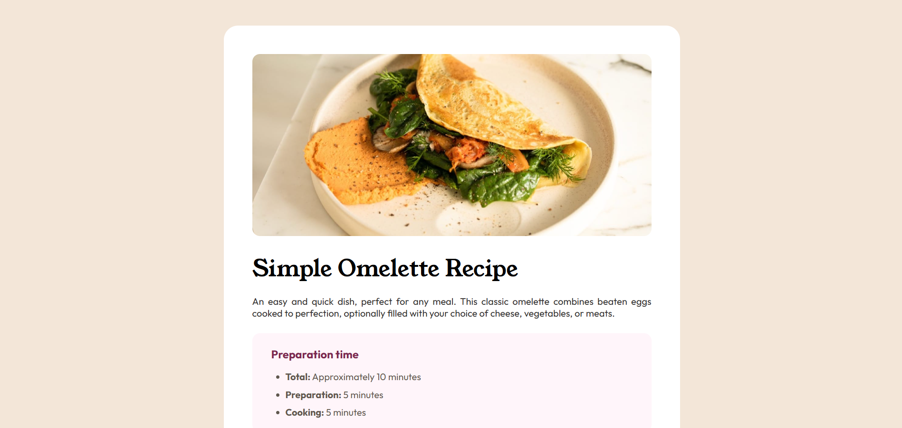

# Frontend Mentor - Recipe page solution

This is a solution to the [Recipe page challenge on Frontend Mentor](https://www.frontendmentor.io/challenges/recipe-page-KiTsR8QQKm). Frontend Mentor challenges help you improve your coding skills by building realistic projects. 

## Table of contents

- [Overview](#overview)
  - [Screenshot](#screenshot)
  - [Links](#links)
  - [Built with](#built-with)
- [Author](#author)

## Overview

### Screenshot

### Links

- Solution URL: [Repository](https://github.com/arturalencar/recipe-page)
- Live Site URL: [Live Page](https://arturalencar.github.io/recipe-page/)

### Built with

- Semantic HTML5 markup
- CSS custom properties
- Flexbox

## Author

- GitHub - [Artur Alencar](https://www.github.com/arturalencar)
- Frontend Mentor - [@arturalencar](https://www.frontendmentor.io/profile/arturalencar)
